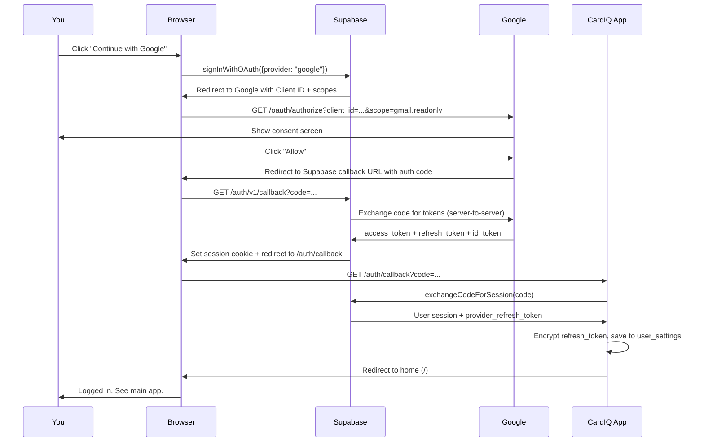
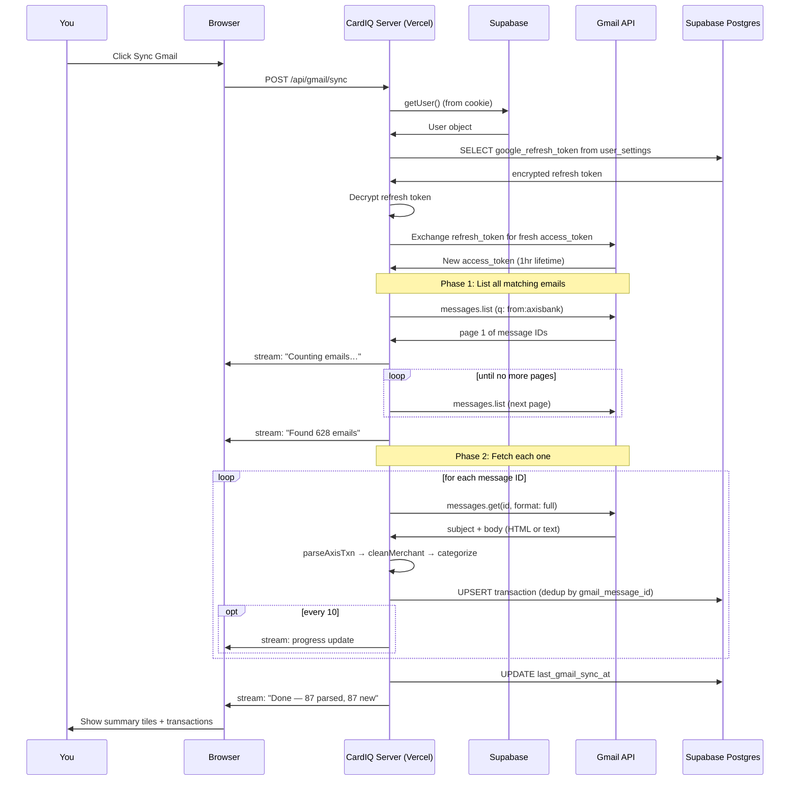
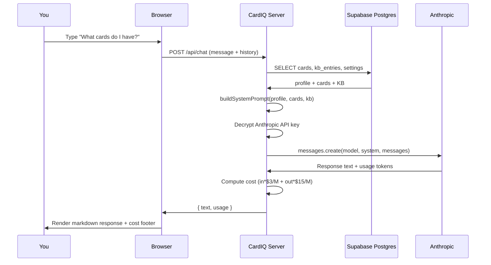

# CardIQ — Architecture Explainer

> A visual walkthrough of what CardIQ is, what every piece does, and why each setup step was needed.
> Read this if you want to understand "what did I just build?" — no jargon, lots of pictures.

---

## 1. The 30-second mental model

```
                   ┌───────────────────────┐
                   │       YOU             │
                   │   (any device)        │
                   └───────────┬───────────┘
                               │  visits
                               ▼
                   ┌───────────────────────┐
                   │       VERCEL          │  ← public URL, runs the app
                   │   (Next.js webapp)    │
                   └─────┬───────────┬─────┘
                         │           │
                         │           │ asks Claude
                         │           ▼
                         │     ┌──────────────┐
                         │     │  ANTHROPIC   │
                         │     │  (Claude API)│
                         │     └──────────────┘
                         │
                         │ stores/reads data + checks login
                         ▼
                   ┌───────────────────────┐
                   │      SUPABASE         │  ← database + sign-in
                   │   (Postgres + Auth)   │
                   └───────────────────────┘
                         │
                         │ asks "is this user logged in via Google?"
                         ▼
                   ┌───────────────────────┐
                   │    GOOGLE CLOUD       │  ← OAuth + Gmail API
                   │  (your Gmail account) │
                   └───────────────────────┘
```

Four moving parts. You created accounts on three of them (Vercel, Supabase, Google Cloud). The fourth (Anthropic) you already had.

---

## 2. What each piece is, in one paragraph

### Vercel — "the host"
A free service that runs your website at a public URL like `cardiq-yourname.vercel.app`. Whenever you `git push` to GitHub, Vercel automatically rebuilds and redeploys. You don't manage servers — Vercel does. **In CardIQ:** it runs the Next.js app you see in the browser.

### Supabase — "the brain (database) + bouncer (login)"
Two services bundled into one:
1. A **Postgres database** (the same database used by basically every serious app). All your cards, transactions, settings, and chat history live here.
2. An **Auth service** that handles "sign in with Google" — including the OAuth dance, session cookies, and token refresh.

Think of Supabase as "AWS RDS + Auth0 + Firebase, in one free tier."

### Google Cloud — "the permission slip"
This is **not** a database or storage. It's the gatekeeper for your Google account. To read your Gmail programmatically, the app needs Google's permission, granted via **OAuth 2.0** — the same "Continue with Google" flow you've used a hundred times. You created an "OAuth client" in Google Cloud Console; this gave the app a Client ID + Secret it uses to legitimately ask Google "can this user grant Gmail access to this app?"

### Anthropic — "the smart layer"
The Claude API. Powers the Chat tab. The app sends Claude your question + your card data + your KB state, Claude responds. Costs ~$0.005 per query.

---

## 3. The setup steps you ran, explained

### Step 1: Run SQL in Supabase
**What you did:** SQL Editor → paste `001_init.sql` → Run.

**What it actually did:** Created empty tables in the Postgres database. Like setting up empty filing cabinets labeled "cards", "transactions", "user_settings", etc. with rules about what shape data fits in each one.

```
Supabase Postgres
  ├─ users (built-in, managed by Supabase Auth)
  ├─ user_settings    ← your encrypted Anthropic key + Google refresh token
  ├─ cards            ← the cards you've added
  ├─ transactions     ← parsed Axis emails
  ├─ kb_entries       ← cached LLM summaries per card+topic
  ├─ chat_messages    ← chat history
  ├─ session_summaries
  └─ merchant_mappings ← your custom merchant→category overrides
```

### Step 2: Copy Supabase keys
**What you copied:**
- `SUPABASE_URL` — where your database lives
- `ANON_KEY` — the public key the browser uses (safe to expose; RLS enforces auth)
- `SERVICE_ROLE_KEY` — the admin key the server uses (must be secret)

**Why three keys:** browser JS can't be trusted with admin power, but it needs *some* way to talk to Supabase. The anon key + Row Level Security combo is Supabase's solution: the browser key works, but every query is filtered to "rows where `user_id = the logged-in user`."

### Step 3: Set up Google OAuth
**What you did:** Created a "CardIQ Web" OAuth Client in Google Cloud, enabled the Gmail API, added your Gmail as a test user.

**What it actually did:**
1. Told Google "an app called CardIQ exists and wants permission to read Gmail."
2. Got back a Client ID + Client Secret — the app's "API password" with Google.
3. Added a redirect URL — Google's promise: "after the user clicks Allow, send them back to this URL."
4. Marked the app as "Testing" — only you can use it (no verification needed since it's personal).

```
Google's view of your OAuth setup:

  [App: CardIQ Web]
    ├── Client ID: 286193102507-ipvq...
    ├── Scopes requested: gmail.readonly + profile + email
    ├── Redirect URI: https://YOURPROJ.supabase.co/auth/v1/callback
    └── Test users: [your gmail address]
```

### Step 4: Wire Google into Supabase
**What you did:** In Supabase Auth → Providers → Google → pasted Client ID + Secret.

**What it did:** Told Supabase "when a user clicks Continue with Google, use *this* Google OAuth client to do it." Supabase now handles the OAuth dance on the app's behalf.

### Step 5: Local `.env.local`
**What you did:** Generated an encryption key, pasted all the Supabase + Google credentials into a file.

**What it did:** Gave the Next.js app the keys it needs to talk to Supabase + Google. The encryption key is what scrambles your Anthropic API key + Google refresh token before storing them in the database (so even if someone steals the DB, they can't read those secrets without the encryption key, which lives only in env vars).

### Step 6: `npm run dev`
**What you did:** Started the Next.js development server.

**What it did:** Built the React app, started a local web server on port 3000, watched files for changes. This is the *dev* version — slower, with hot-reload. The production version on Vercel is precompiled and faster.

---

## 4. What happens when you click "Continue with Google"

This is the most magical-feeling part. Here's the actual sequence:



**Key insight:** the "magical" Continue with Google is actually 12+ HTTP redirects. Supabase + Google handle most of them. The only one we wrote is `/auth/callback` — and its only job is to grab the refresh token and save it for later Gmail use.

---

## 5. What happens when you click "Sync Gmail"



**Key insight:** the streaming response (`Content-Type: text/plain` with newline-delimited JSON) is what gives you the live progress counter. The browser reads chunks as they arrive, parses each line as JSON, and updates the UI in real-time.

---

## 6. What happens when you ask a chat question



The system prompt that's built every time looks like:
```
You are CardIQ, a concise credit-card research assistant.

# USER PROFILE
I'm based in India, optimize for spends...

# CARDS
- Axis Magnus Burgundy (••2294)
- Axis Magnus Burgundy - Papa (••4455)

# KNOWLEDGE BASE
(empty until KB fetch is implemented)

# ROUTING RULES
1. If KB has fresh entry, answer from it.
2. If stale, emit JSON fetch signal: {"action":"fetch","card":"...",...}
3. Never fetch >1 URL per response.
4. ...
```

---

## 7. The data flow, top to bottom

```
                    ┌─────────────────────────────┐
                    │   Gmail (your inbox)        │
                    │   Axis transaction emails   │
                    └──────────────┬──────────────┘
                                   │ Gmail API
                                   │ (OAuth, readonly)
                                   ▼
                    ┌─────────────────────────────┐
                    │   /api/gmail/sync           │
                    │   • parseAxisTxn            │
                    │   • cleanMerchant           │
                    │   • categorize              │
                    └──────────────┬──────────────┘
                                   │ UPSERT
                                   ▼
                    ┌─────────────────────────────┐
                    │   transactions table        │
                    │   (raw_body kept verbatim)  │
                    └──────────────┬──────────────┘
                                   │
        ┌──────────────────────────┼─────────────────────────┐
        │                          │                         │
        ▼                          ▼                         ▼
  ┌──────────────┐         ┌──────────────┐         ┌──────────────┐
  │ /api/spend   │         │ /api/chat    │         │/api/recategor│
  │              │         │   (system    │         │   ize        │
  │ aggregates → │         │    prompt    │         │ re-cooks     │
  │ summary,     │         │    pulls KB) │         │ stored emails│
  │ by_merchant, │         │              │         │ with new     │
  │ by_category  │         │              │         │ rules        │
  └──────┬───────┘         └──────┬───────┘         └──────────────┘
         │                        │
         ▼                        ▼
  ┌──────────────┐         ┌──────────────┐
  │  SpendTab    │         │  ChatTab     │
  │  (filters,   │         │  (markdown,  │
  │  pagination, │         │  cost line)  │
  │  search)     │         │              │
  └──────────────┘         └──────────────┘
```

---

## 8. The folder structure, explained

```
cardiq-app/
├── src/app/                  ← Pages and API routes (Next.js convention)
│   ├── page.tsx              ← The main app shell with the 4 tabs
│   ├── login/                ← Sign-in page
│   ├── auth/callback/        ← Where Google sends you after consent
│   └── api/                  ← Server-side endpoints
│       ├── chat/             ← POST → talks to Anthropic
│       ├── gmail/sync/       ← POST → streams Gmail sync progress
│       ├── spend/            ← GET → returns aggregated spend data
│       ├── recategorize/     ← POST → re-cooks stored transactions
│       └── settings/         ← POST → save Anthropic key + profile
│
├── src/components/           ← UI building blocks
│   ├── ChatTab.tsx
│   ├── SpendTab.tsx
│   ├── CardsTab.tsx
│   └── SessionsTab.tsx
│
├── src/lib/                  ← Business logic, no UI
│   ├── supabase/             ← How we talk to Supabase
│   ├── crypto.ts             ← AES-256 encryption for secrets at rest
│   ├── router.ts             ← The chat system prompt builder
│   ├── parsers/axis.ts       ← Regex to read Axis txn emails
│   ├── merchant-clean.ts     ← Raw merchant name → clean name
│   ├── categorize.ts         ← Merchant → category rules
│   └── cards/                ← Hardcoded card specs (milestones, lounges)
│
├── supabase/migrations/      ← SQL run in order to set up the DB
│   ├── 001_init.sql
│   ├── 002_merchant_mappings_raw_body.sql
│   └── 003_txn_type.sql
│
├── .env.local                ← Secrets (NEVER commit this)
├── .env.local.example        ← Template (safe to commit)
├── README.md                 ← Setup instructions
├── HANDOFF.md                ← For future Claude sessions
└── ARCHITECTURE.md           ← This file
```

---

## 9. Security, simply

| Secret | Where stored | How protected |
|---|---|---|
| Anthropic API key | `user_settings.anthropic_key_encrypted` | AES-256-GCM, encryption key in env vars only |
| Google refresh token | `user_settings.google_refresh_token_encrypted` | Same |
| Google access token | Supabase session cookie | Httponly, encrypted by Supabase |
| Supabase service role key | `.env.local` (local) + Vercel env vars | Server-side only, never sent to browser |
| Encryption key | `.env.local` + Vercel env vars | If you change it, all encrypted secrets become unreadable — keep it stable |

**Row Level Security:** every table in Supabase has a policy that says "you can only see/edit rows where `user_id = your user ID`." Even if someone got your anon key, they can't see anyone else's data.

---

## 10. Why this stack vs. alternatives

| Alternative | Why we didn't pick it |
|---|---|
| Chrome extension | No mobile access (you wanted phone too) |
| Electron desktop app | Same problem; also harder to sync state across machines |
| Local-only app + iCloud sync | Multi-device sync is brittle without a real backend |
| Separate Express + React frontend | More moving parts; Next.js does both in one repo |
| MongoDB / Firestore | Postgres + RLS gives you better querying for spend aggregation |
| Pure REST API + custom auth | Supabase Auth handles Google OAuth + sessions for free |
| Hosted on Render / Fly | Vercel is fastest for Next.js + free tier is generous |

---

## 11. Mental model when you're confused

When something breaks, ask "**which of the 4 boxes is sad?**"

1. **Vercel/local dev sad** → check terminal, browser console, network tab.
2. **Supabase sad** → check Supabase dashboard logs, or run a query in SQL Editor.
3. **Google sad** → check OAuth consent screen, redirect URIs, scopes, test users.
4. **Anthropic sad** → check API key in Cards tab, check usage on console.anthropic.com.

The boxes are independent. Fix the one that's broken, don't shotgun changes.

---

## 12. What happens when you `git push` to GitHub (once you set that up)

```
You: git push origin main
        │
        ▼
   ┌─────────┐
   │ GitHub  │
   └────┬────┘
        │ webhook
        ▼
   ┌─────────┐
   │ Vercel  │  ← detects push, runs `npm run build`
   └────┬────┘
        │
        ▼
   ┌──────────────────┐
   │ Production URL   │  ← updated within ~60 seconds
   │ cardiq-xxx.app   │     anyone (with your test-user Gmail) can use
   └──────────────────┘
```

You never SSH into a server, never manage Docker, never restart anything. Push code → it's live. That's the whole magic of Vercel for Next.js apps.

---

## 13. The holistic layer (added 2026-07-08)

CardIQ grew from "spend dashboard" into a one-stop credit-card destination. Three new tables (migration 009) carry everything the Gmail pipeline can't see:

| Table | What lives there | Lifecycle |
|---|---|---|
| `reward_balances` | Point-balance snapshots per card (EDGE, HDFC RP…) | Tied to a card — deleted with it |
| `offers` | Card offers you want to remember, with validity windows | Optionally card-linked — survives card deletion |
| `loyalty_accounts` | Airline/hotel program tiers, member ids, points | Independent of cards — your Marriott status outlives any card |

**Why manual entry:** there is no safe automated source for these yet (bank portals are login-gated; scraping is brittle). Every row carries `source = 'manual' | 'parsed'` so a future version that parses loyalty/offer emails writes into the *same* tables — no migration needed.

**How it's surfaced:**

```
Overview (home)
  ├─ hero stats           ← transactions (this month, INR)
  ├─ card-art tiles       ← cards × registry specs (milestone %, ≈points est.)
  │     └─ click → Spend, pre-filtered to that card
  ├─ Reward balances      ← reward_balances (latest snapshot per card)
  ├─ Active offers        ← offers (soonest expiry first, ≤14d flagged)
  └─ Loyalty status       ← loyalty_accounts (tier chips, expiry warnings)

Sidebar:  Overview · Spend · Rewards · Offers · Loyalty · Dining · Chat · Cards
```

**Estimates are labeled estimates:** card tiles show "≈ N pts (base-rate estimate)" computed from spend × the card's documented base earn rate (`src/lib/cards/*.ts`). Real balances always come from what you entered in Rewards. The pure logic (latest-snapshot selection, offer expiry, tier lapse) lives in `src/lib/perks.ts` with boundary tests in `perks.test.ts`.
